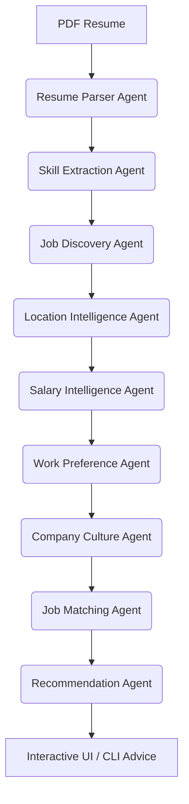

# 💼 Job Search AI Agent

An AI-powered, India-focused career assistant built on a modular **9-Agent Pipeline**.
It fetches **live, real-time job listings** (Adzuna + Jooble), matches them against your
uploaded PDF résumé and work preferences, enriches them with company-culture intelligence,
and presents everything through a polished, multi-page **Streamlit** application — with
résumé analysis, company research, an application tracker, analytics, and PDF/CSV export.

> Production-ready, deployable to **Render** in minutes.

---

## ✨ Features

| Area | What you get |
|------|--------------|
| 🔍 **Job Search Dashboard** | Live multi-source search, **filters** (source, min rec-score, salary-only) and **sorting** (rec score, salary, match, A→Z), source-quality stats, historical salary trends. |
| 📄 **Résumé Analysis + ATS** | Upload a PDF → auto skill extraction, **skills-by-category** breakdown, an **ATS match score** against a pasted job description (keyword coverage, missing keywords, hygiene checks), **role-fit scoring**, and a one-click **tailored Skills-Profile PDF** ("résumé version"). |
| 🏢 **Company Research** | Culture scores (WLB, growth, salary competitiveness, remote-friendliness) + authoritative research links, cached locally. |
| 📋 **Application Tracker** | Kanban-style cards across **Saved → Applied → Interview → Offer / Rejected**, with status updates, delete, and export. |
| 🎤 **Mock Interview** | Text-based, role-specific interview (Technical + Behavioural + **India HR rounds** — notice period, LPA negotiation, relocation) with instant **STAR-structured feedback** and scoring. |
| 📊 **Analytics** | Application funnel, most-searched roles/cities, salary distribution, connector reliability — all from local data. |
| ⬇️ **Export** | Job lists & tracker as **PDF** (ReportLab) and **CSV**; résumé profile as PDF. |
| 🎨 **Premium UI** | Curated design system (see [DESIGN.md](DESIGN.md)) — Outfit/Jakarta/JetBrains-Mono type, zinc neutrals + a single emerald accent, soft diffusion shadows. No AI-purple, no neon. |
| 🛡️ **Robustness** | Input validation (résumé magic-bytes/size, search params) and **friendly error messages** for API timeouts, auth failures, rate limits, and connectivity issues. |

---

## 🤖 9-Agent Pipeline Architecture

Each agent executes sequentially, passing an enriched `AgentContext` down the pipeline:



1. **Resume Parser** (`resume_agent.py`) — extracts & cleans text from the PDF (PyPDF2).
2. **Skill Extraction** (`skills_agent.py`) — matches text against a tech-skill vocabulary.
3. **Job Discovery** (`discovery_agent.py`) — builds skill-enriched queries, fetches from **Adzuna** & **Jooble**.
4. **Location Intelligence** (`location_agent.py`) — scores/filters by preferred cities.
5. **Salary Intelligence** (`salary_agent.py`) — normalises pay to **LPA**, compares to expectations.
6. **Work Preference** (`work_preference_agent.py`) — scores Remote/Hybrid/Onsite + notice period.
7. **Company Culture** (`culture_agent.py`) — synthesises culture scores (DB cache + web scraping).
8. **Job Matching** (`matching_agent.py`) — composite compatibility score.
9. **Recommendation** (`recommendation_agent.py`) — re-ranks and writes natural-language advice.

The `AgentOrchestrator` (`orchestrator.py`) drives the pipeline and **degrades gracefully** —
a failing step never crashes the run.

---

## 📂 Project Structure

```text
├── app.py                       # 🏠 Streamlit home — Job Search dashboard
├── pages/                       # 📑 Multi-page Streamlit app
│   ├── 1_📄_Resume_Analysis.py  # Résumé analysis + ATS match
│   ├── 2_🏢_Company_Research.py
│   ├── 3_📋_Application_Tracker.py
│   ├── 4_📊_Analytics.py
│   └── 5_🎤_Mock_Interview.py   # Text-based mock interview + feedback
│
├── agents/                      # 🤖 The 9 pipeline agents (+ base_agent, AgentContext)
├── connectors/                  # 🔌 Adzuna / Jooble (live) + Naukri / TimesJobs (mock)
├── orchestrator.py              # 🧠 Sequential pipeline driver
│
├── ui_common.py                 # 🎨 Shared CSS, hero, job cards, skill helpers, error mapping
├── ats.py                       # 🎯 Offline ATS / JD keyword-match engine
├── interview.py                 # 🎤 Mock-interview question bank + feedback engine
├── validation.py                # ✅ Résumé & search-parameter validation
├── exporters.py                 # ⬇️ PDF (ReportLab) + CSV export
├── database.py                  # 🗄️ SQLite persistence layer
├── config.py                    # ⚙️ .env loader (single source of truth for keys)
├── company.py                   # 🔗 Company research links
├── main.py                      # 🚀 CLI interface
│
├── DESIGN.md                    # 🎨 Design system (single source of truth)
├── render.yaml / Procfile / runtime.txt   # ☁️ Deployment
├── requirements.txt
└── .streamlit/config.toml       # Theme + server settings
```

---

## ⚡ Run Locally

### 1. Install dependencies
```bash
pip install -r requirements.txt
```

### 2. Configure API keys
Copy `.env.example` → `.env` and fill in your credentials:
```env
ADZUNA_APP_ID=your_adzuna_app_id      # free: https://developer.adzuna.com/
ADZUNA_APP_KEY=your_adzuna_app_key
JOOBLE_API_KEY=your_jooble_api_key    # free: https://jooble.org/api/about
JOB_FETCH_COUNT=15
```
> You can also paste keys directly into the app sidebar to override per session.
> At least **one** connector must be configured (Adzuna needs *both* ID + Key; Jooble needs its key).

### 3. Launch the app
```bash
streamlit run app.py
```
Open http://localhost:8501 and use the page navigation in the sidebar.

### 4. (Optional) CLI mode
```bash
python main.py
```

---

## ☁️ Deploy to Render (recommended)

This repo ships a **Render Blueprint** (`render.yaml`).

1. Push the repo to GitHub.
2. In Render → **New +** → **Blueprint** → select your repo. Render reads `render.yaml`:
   - **Build:** `pip install -r requirements.txt`
   - **Start:** `streamlit run app.py --server.port $PORT --server.address 0.0.0.0 --server.headless true`
   - **Health check:** `/_stcore/health`
3. In the service's **Environment** tab, add the secrets:
   `ADZUNA_APP_ID`, `ADZUNA_APP_KEY`, `JOOBLE_API_KEY` (and optionally `JOB_FETCH_COUNT`).
4. Deploy. Render gives you a public `https://…onrender.com` URL.

**Manual setup (no Blueprint):** create a *Web Service* → Runtime **Python 3** →
Build `pip install -r requirements.txt` → Start
`streamlit run app.py --server.port $PORT --server.address 0.0.0.0 --server.headless true`.

> ⚠️ **Data persistence:** the SQLite file lives on the container's ephemeral disk and
> **resets on each deploy** on Render's free tier. For durable history, attach a Render
> **Persistent Disk** and point `DB_PATH` at it, or migrate to Postgres.

> 💡 **Why not Vercel?** Vercel targets serverless/static (Next.js). Streamlit needs a
> long-lived server, which Render/Streamlit Community Cloud handle natively.

---

## 🔑 Getting API Keys

- **Adzuna** — register a free app at <https://developer.adzuna.com/>; copy the **App ID** and **App Key**.
- **Jooble** — request a free API key at <https://jooble.org/api/about>.

No keys? The app still loads, validates input, and shows a clear prompt — it just can't return live jobs.

---

## 🧪 Validation & Error Handling

- **Résumé uploads** are checked for extension, size (≤ 10 MB), and the `%PDF` magic header — files renamed to `.pdf` are rejected.
- **Search params** validate role length/content, required location, and a sane salary range.
- **API failures** are translated into actionable messages (timeout, offline, 401/403 auth, 429 rate-limit).

---

## 🛠️ Troubleshooting

| Symptom | Fix |
|--------|-----|
| "No API credentials configured" | Add keys in the sidebar or `.env`. |
| PDF export buttons disabled | `pip install reportlab`. |
| "PyPDF2 not installed" on résumé upload | `pip install PyPDF2` and restart. |
| No jobs returned | Broaden the role, switch city, lower salary, or check key validity. |
| Tracker empty | Run a search, then click **Track** on a job card. |

---

## 🔒 Security & Privacy

- API keys load only from `.env` / environment / sidebar — never hard-coded.
- Résumé bytes are processed in-memory; the pipeline writes them to a temp file that is deleted after parsing.
- All persisted data (searches, saved jobs, culture cache) stays in a **local SQLite** file — nothing is sent to third parties beyond the job APIs you configure.

---

## 📜 License

For educational / portfolio use. Respect the terms of service of all integrated job APIs.
