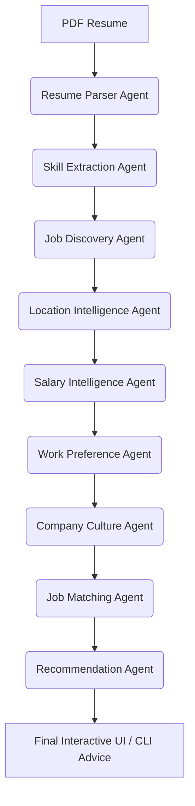

# 💼 Job Search AI Agent

An AI-powered job search and career assistant powered by a modular **9-Agent Pipeline**. It fetches live, real-time job listings from integrated platforms (Adzuna and Jooble) and matches them intelligently using your uploaded PDF resume and work preferences.

---

## 🤖 9-Agent Pipeline Architecture

The system utilizes an agentic workflow where each agent executes sequentially, passing enriched context down the pipeline:



1. **Resume Parser Agent (`resume_agent.py`):** Automatically extracts and cleans raw text from your uploaded PDF resume using PyPDF2.
2. **Skill Extraction Agent (`skills_agent.py`):** Scans the resume text against a predefined vocabulary of tech skills to build your profile.
3. **Job Discovery Agent (`discovery_agent.py`):** Dynamically builds search queries using your target role and top skills, fetching listings from live APIs (**Adzuna** and **Jooble**).
4. **Location Intelligence Agent (`location_agent.py`):** Scores and filters job locations based on your preferred cities.
5. **Salary Intelligence Agent (`salary_agent.py`):** Standardizes compensation ranges into Lakhs Per Annum (LPA) and evaluates matches against your expectations.
6. **Work Preference Agent (`work_preference_agent.py`):** Scores jobs on arrangement compatibility (Remote, Hybrid, Onsite) and notice period requirements.
7. **Company Culture Agent (`culture_agent.py`):** Fallback web scraping via DuckDuckGo reviews to synthesize employee WLB, growth, and company culture scores.
8. **Job Matching Agent (`matching_agent.py`):** Computes a composite compatibility match score using skills, location, salary, and work preferences.
9. **Recommendation Agent (`recommendation_agent.py`):** Generates structured natural language career guidance and re-ranks opportunities.

---

## 📂 Project Structure

```text
├── agents/                  # 🤖 Individual Pipeline Agents
│   ├── base_agent.py        # Shared AgentContext state & BaseAgent interface
│   ├── resume_agent.py      # Resume Parser Agent
│   ├── skills_agent.py      # Skill Extraction Agent
│   ├── discovery_agent.py   # Job Discovery Agent
│   ├── location_agent.py    # Location Intelligence Agent
│   ├── salary_agent.py      # Salary Intelligence Agent
│   ├── work_preference_agent.py # Work Preference Agent
│   ├── culture_agent.py     # Company Culture Intelligence Agent
│   ├── matching_agent.py    # Job Matching/Scoring Agent
│   └── recommendation_agent.py # Career Advice & Re-ranking Agent
│
├── connectors/              # 🔌 Job Search API Integrations
│   ├── base.py              # Canonical schema normalization
│   ├── aggregator.py        # Coordinates and merges connector results
│   ├── adzuna_connector.py  # Live Adzuna Jobs API wrapper
│   ├── jooble_connector.py  # Live Jooble Jobs API wrapper
│   ├── naukri_connector.py  # Mock/simulated Naukri connector
│   └── timesjobs_connector.py # Mock/simulated TimesJobs connector
│
├── app.py                   # 💻 Modern Streamlit Web Application
├── main.py                  # 🚀 Interactive command-line (CLI) interface
├── config.py                # ⚙️ Env loader for API keys & constants
├── database.py              # 🗄️ SQLite persistence layer
└── requirements.txt         # Python package dependencies
```

---

## ⚡ Getting Started Locally

### 1. Install Dependencies
```bash
pip install -r requirements.txt
```

### 2. Configure Environment variables
Create a `.env` file in the project root containing your API credentials:
```env
# Adzuna API (free tier: https://developer.adzuna.com/)
ADZUNA_APP_ID=your_adzuna_app_id
ADZUNA_APP_KEY=your_adzuna_app_key

# Jooble API (free tier: https://jooble.org/api/about)
JOOBLE_API_KEY=your_jooble_api_key

# Default results limit per fetch
JOB_FETCH_COUNT=15
```

### 3. Run the Streamlit UI
Start the interactive dashboard interface:
```bash
streamlit run app.py
```
*Allows you to upload your resume, configure target preferences, fetch live jobs, analyze source quality statistics, look up culture insights, and bookmark/save listings.*

### 4. Run the AI Career CLI
Alternatively, run the conversational pipeline from your terminal:
```bash
python main.py
```
